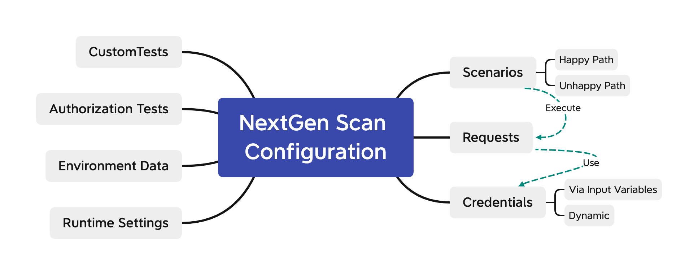

# Scan V2 Configuration Guide

Nextgen API Scan engine comes with a number of enhancements, including:

* Ability for a user to tailor the tests and inputs into the tests executed by the engine

- Ability to define complex happy paths requests (scenarios chaining multiple API calls)
- Ability to define advanced security tests, such as BOLA or BFLA testing
- Ability to create and destroy resources as part of the testing flow
- Ability to dynamically obtain credentials
- Ability to define custom tests

## Configuration Structure



A **request** corresponds to one operation in the OAS file that was used to generate the configuration. Requests are executed as part of **scenarios**. A scenario composes one or multiple requests.

Requests may or may not require **credentials** to execute (an API key, an OAuth token). Credentials can be statically assigned via input **variables** or generated dynamically through the execution of a request. 

The scan engine is capable of executing conformance scan tests, security tests as well as custom tests. For each scenario, the scan engine can also execute pre-requisites requests (**before** block) and cleanup requests (**after** block). It also support global before/after requests blocks, for example to create the necessary users or preload a database to run the tests.

## Requests

Default requests are generated from the OAS file used to create the scan configuration. 

- OperationID is used as the request id (here, edituserinfo) . If an operation Id is not available in the OAS file, one is created from the path and verb, for example : `/picture/file_upload:post`

  > We recommend to set up an operationId for each operation in the OAS file, in order to avoid long, complicated generated names.

- Property values (email, name) are set from examples, default values, or are randomly generated from a regular expression if available (as in the case of `name` below). 

- If required, `auth` is set from the security schemes definition (here `access-token`)

- Responses are generated for each response code in the OpenAPI description.

```JSON
        "edituserinfo": {
            "operationId": "edituserinfo",
            ...
            "request": {
                "operationId": "edituserinfo",
                "auth": [
                    "access-token"
                ],
                "request": {
                    "type": "42c",
                    "details": {
                        "url": "{{host}}/user/edit_info",
                        "method": "PUT",
                        "headers": [
                            {
                                "key": "Content-Type",
                                "value": "application/json"
                            }
                        ],
                        "requestBody": {
                            "mode": "json",
                            "json": {
                                "email": "foo@bar.com",
                                "name": "JNIf\n4toL"
                            }
                        }
                    }
                },
                "defaultResponse": "200",
                "responses": {
                    "200": {
                        "expectations": {
                            "httpStatus": 200
                        }
                    },
                    "403": {
                        "expectations": {
                            "httpStatus": 403
                        }
                    },
                    "default": {
                        "expectations": {
                            "httpStatus": "default"
                        }
                    }
                }
            }
        },
```

## Scenarios

Scenarios are defining the requests to execute, by path. 

For each path, you can specify :

- One or multiple HappyPath blocks:
  - Happy path scenarios are meant to test success use cases, typically the ones returning a 2XX code. By defining multiple happy path scenarios, you can test multiple combinations and ensure that all the 2XX combinations are covered (say 200, 202 and 206).
  - One of the happy path scenarios must be tagged with `"fuzzing": true`. This identifies the scenario that is used to decide if fuzzing (i.e. the series of tests executed by the scan) will happen or not. This scenario must have an expected API response in order for the scan to proceed to test the operation.

- One or multiple Unhappy Path blocks:
  - Unhappy path scenarios are meant to test failure use cases, i.e. typically scenarios returning 4XX codes. Similarly to happy path scenarios, you can test multiple combinations and ensure that all the 4XX combinations are tested (say 400, 404 and 418 (!))


```JSON
...
"operationId": "getuser",
            "scenarios": [
                {
                    "key": "happy.path",
                    "fuzzing": true,
                    "requests": [
                        {
                            "$ref": "#/operations/getuser/request",
                            "fuzzing": true
                        }
                    ]
                },
              	{
                    "key": "unhappy.path",
                    "requests": [
                        {		
 														"environment": {
                        				"userid": 123
                    				},
                            "$ref": "#/operations/getuser/request",
                          	"expectedResponse": "404",
                        }
                    ]
                }
            ],
```

#### Before / After Blocks

You can use before and after for setup or to satisfy pre-requisites. For example, in the case below, a PetStore must exist before Pet can be created. We therefore create a Petstore first and then delete it once the testing of the createPet operation completes.

```JSON
..
	"operationId": "CreatePet",
	"before": [
        {
            "$ref": "../CreatePetstore/request.json"
        }
    ],
   "after": [
        {
            "$ref": "../DeletePetstore/request.json"
        }
   ],
   "scenarios": [
        {
            "key": "happy.path",
            "fuzzing": true,
            "requests": [
                {
                    "fuzzing": true,
                    "$ref": "request.json"
                },
                {
                    "$ref": "../DeletePet/request.json"
                }
            ]
        }
    ]
}
```

You can also define `before` and `after` blocks at the global level. In this case, they will executed before API operations are tested and afte they are tested. 

> A failure in the execution of the global `before` block will stop the scan processing.

#### Scenarios execution

* Before and after blocks, should they be at operation or global level, are only executed once.
* Requests defined in the happyPaths block are executed for each test (not just the happy path tests). For example, if an injection is trying to create a picture using an integer instead of a string and that injection works (code 2XX), the delete picture request will also be executed in order to leave a clean data state. 

```json
				"requests": [
                        {
                            "environment": {
                                "contents": "...",
                                "title": "Upload from before block"
                            },
                            "$ref": "#/operations/uploadPicture/request",
                            "responses": {
                                "200": {
                                    "expectations": {
                                        "httpStatus": 200
                                    },
                                    "variableAssignments": {
                                        "before_picture_id": {
                                            "from": "response",
                                            "in": "body",
                                            "contentType": "json",
                                            "path": {
                                                "type": "jsonPath",
                                                "value": "$._id"
                                            }
                                        }
                                    }
                                }
                            }
                        },
                        {   
                            "environment": {
                                "picture_id": "{{before_picture_id}}"
                            },
                            "$ref": "#/operations/deletePicture/request",
                            "fuzzing": true
                        }
                    ]
```

## Variables

Variables are used to pass information across different blocks of the configuration, for example, to setup a credential, fill parameters or request body properties. Notation for variable is `{{variable_name}}`.

Variables values can be set from: 

- Environment
- Response Processing

#### Scoping

- Variables created at the scenario level (for example in a global `before` block) are globally visible.

- Variables created as part of the authentication section are only visible for authorization tests (BOLA /BFLA).

  > TODO: Check if this is still true, as runtime traces seem to evidence all variables are global ??

## Environment Data

Environment data is used to fill variables. Data can be defined at:

- Global level 
- At request time. 

#### Global level

In the following block, several variables are initialized at global level from either system environment variables or from an hardcoded value.

```JSON
   "environments": {
        "default": {
            "variables": {
                "access-token": {
                    "from": "environment",
                    "name": "SCAN42C_SECURITY_ACCESS_TOKEN",
                    "required": true
                },
                "host": {
                    "from": "hardcoded",
                    "name": "SCAN42C_HOST",
                    "required": false,
                    "value": "https://myapiserver.com/api"
                },
                "inbound_user": {
                    "from": "environment",
                    "name": "SCAN42C_user",
                    "required": true
                },
                "inbound_pass": {
                    "from": "environment",
                    "name": "SCAN42C_pass",
                    "required": true
                }
            }
        }
    }
```

Note that the environment has a name (here `default`). You can switch across environments by overriding the environment variable in the runtime configuration.

```json
    "runtimeConfiguration": {
        "environment": "default",
```

At scan execution time, you would set the variables above with:

```shell
docker run -e SCAN_TOKEN='scan_xxxx'-e SCAN42C_host='https://photo-demo.westeurope.cloudapp.azure.com/version1/api' -e SCAN42C_user=65713@acme.com -e SCAN42C_pass=hellopixi 42crunch/scand-agent:v2.0.0
```

#### Runtime override

When a request is expecting certain variables to be set, the variables value can be overriden when the request is executed. In this following example, `dynamic_pass` and `dynamic_user` are overriden. 

The value of a variable overriden this way takes precedence over the globally defined value. The example below assumes a variable called created_picture_id has alredy been populated.

```json
{   
       "environment": {
            "picture_id": "{{created_picture_id}}"
        },
        "$ref": "#/operations/deletePicture/request",
        "fuzzing": true
}
```

In the sample request below, the `host`variable value is set from the global environment, while `dynamic_pass` and `dynamic_user` come from the environment values set when the request is executed.

```JSON
"request": {
                    "type": "42c",
                    "details": {
                        "url": "{{host}}/user/register",
                        "method": "POST",
                        "headers": [
                            {
                                "key": "Content-Type",
                                "value": "application/json"
                            }
                        ],
                        "requestBody": {
                            "mode": "json",
                            "json": {
                                "account_balance": 500,
                                "is_admin": false,
                                "name": "{{$random}}",
                                "pass": "{{dynamic_pass}}",
                                "user": "{{dynamic_user}}"
                            }
                        }
                    }
                },
```

### Response Processing

You can add response processing to any request, to extract information from the request that was sent or from the response and assign it to a variable. Both json_pointer and json_path notations are supported. 

Data can only be extracted only from the request/response body.

```json
"responses": {
                    "200": {
                        "expectations": {
                            "httpStatus": 200
                        },
                        "variableAssignments": {
                            "user_token": {
                                "from": "response",
                                "in": "body",
                                "contentType": "json",
                                "path": {
                                    "type": "jsonPath",
                                    "value": "$.token"
                                }
                            },
                            "user_id": {
                                "from": "response",
                                "in": "body",
                                "contentType": "json",
                                "path": {
                                    "type": "jsonPointer",
                                    "value": "/_id"
                                }
                            }
                        }
                    },
```

### Custom Tests

Custom tests can be defined at the operation level only. You can use custom tests to inject some specific data, for example here we want to validate that a user can't be made an admin by injecting a specific property value. 

For that we create a specific request, and use it as part of the custom test.

```JSON
"customTests": [
                {
                    "requests": [
                        {
                            "$ref": "#/requests/makeUserAdmin",
                          	"expectedResponse": "403",
                        }
                    ]
                }
            ],

...

"makeUserAdmin": {
            "operationId": "edituserinfo",
            "auth": [
                "access-token/User2"
            ],
            "request": {
                "type": "42c",
                "details": {
                    "url": "{{host}}/user/edit_info",
                    "method": "PUT",
                    "headers": [
                        {
                            "key": "Content-Type",
                            "value": "application/json"
                        }
                    ],
                    "requestBody": {
                        "mode": "json",
                        "json": {
                            "email": "foo@bar.com",
                            "name": "JNIf\n4toL",
                            "is_admin": true
                        }
                    }
                }
            },
```

### Authentication and Credentials

Credentials are used to authenticate an API call. Authentication definitions can contain one of multiple credentials, as illustrated below.

Each authentication has several properties:

- **Type** (apikey, oauth, basic) as per the OAS security scheme.
- **Location** (header, query)
- **Name** (where the credential will be passed, i.e. the x-access-token header in our example)
- **TimeToLive** (here 120s): if the credential is obtained dynamically, this is the delay after which the scan will renew it
- A **default** credential , in our case `User1`. If we refer to the `access-token` authentication in a request, the `User1` credential will be used. If you want a specific credential, use `<AuthName>/<CredentialName>`  instead, for example `access-token/Admin`. 

```JSON
"authenticationDetails": [
{
	"access-token": {
                "credentials": {
                    "User1": {
                        "credential": "{{access-token-user1}}",
                        "description": "User1 Token"
                    },
                    "User2": {
                        "credential": "{{access-token-user2}}",
                        "description": "User2 Token"
                    },
                    "Admin": {
                        "credential": "{{access-token-admin}}",
                        "description": "Admin User Token"
                    }
                },
                "type": "apiKey",
                "in": "header",
                "name": "x-access-token",
                "ttl": "120s",
                "default": "User1"
}
```

### BOLA and BFLA Testing

You can define BOLA and BFLA tests by swapping authentication tokens. In BOLA, we test the access to a resource by the wrong user (OWASP API 1), in BFLA we test the access to an operation by a wrong user (OWASP API 5).

```JSON
"authorizationTests": {
        "DeleteOwnPicture": {
            "key": "authentication-swapping-bola",
            "source": [
                "access-token/User1"
            ],
            "target": [
                "access-token/User2"
            ]
        },  
        "AdminOnlyOps": {
            "key": "authentication-swapping-bfla",
            "source": [
                "access-token/Admin"
            ],
            "target": [
                "access-token/User2"
            ]
        }
    },
```

An authorization test is applied to an operation with the following notation - Here we will execute the **AdminOnlyOps** test on the `/admin/all_users` operation by first invoking it with the `Admin` user and then a normal user. 

```JSON
"deletePicture": {
            "operationId": "deletePicture",
            "authorizationTests": [
                "DeleteOwnPicture"
            ],
            "scenarios": [
                {
                    "key": "happy.path",
                    "fuzzing": true,
                    "requests": [
                        {
                            "environment": {
                                ...
                            },
                            "$ref": "#/operations/uploadPicture/request",
                            "responses": {
                                ...
                            }
                        },
                        {   
                            "environment": {
                                "picture_id": "{{before_picture_id}}"
                            },
                            "$ref": "#/operations/deletePicture/request",
                            "fuzzing": true
                        }
                    ]
                }
            ],
```

### Runtime Configuration

The scan configuration embarks a number of runtime settings you can use to :

- Change the logLevel
- Change logs destination
- Change logs and reports size limits
- Control the duration of the scan as well usage limits (memory, payloads)
- Optimize the scan report by omitting certain data, such as the curl command used to reproduce the tests.

```JSON
"runtimeConfiguration": {
        "environment": "default",
        "logLevel": "debug",
        "logDestination": "stdout+platform",
        "logMaxFileSize": 2147483648,
        "requestHeaderNameRequestId": "x-scan-request-id",
        "requestHeaderNameScenarioId": "x-scan-scenario-id",
        "requestFlowrate": 100,
        "requestTimeout": 30,
        "requestTlsInsecureSkipVerify": true,
        "responseFollowRedirection": false,
        "responseMaxBodySizeScan": 10485760,
        "happyPathOnly": false,
        "maxScanDuration": 3600,
        "memoryLimit": 2147483648,
        "memoryTimeSpan": 10,
        "reportMaxHttpResponseSizeHappyPath": 8092,
        "reportMaxBodySizeHappyPath": 8092,
        "reportMaxHttpResponseSizeTest": 8092,
        "reportMaxBodySizeTest": 8092,
        "reportIssuesOnly": false,
        "reportMaxIssues": 1000,
        "reportMaxSize": 20971520,
        "reportGenerateCurlCommand": true
    },
```

You can override any variable at execution time passing it as an environment variable to the docker command - Following table matches name in conf to env variable name. 

| Runtime Conf Setting               | Env Variable name                                |
| ---------------------------------- | ------------------------------------------------ |
| logLevel                           | SCAN42C_LOG_LEVEL                                |
| logDestination                     | SCAN42C_LOG_DESTINATION                          |
| logMaxFileSize                     | SCAN42C_LOG_MAX_FILE_SIZE                        |
| requestHeaderNameRequestId         | SCAN42C_REQUEST_HEADER_NAME_REQUEST_ID           |
| requestHeaderNameScenarioId        | SCAN42C_REQUEST_HEADER_NAME_SCENARIO_ID          |
| requestFlowrate                    | SCAN42C_REQUEST_FLOWRATE                         |
| requestTimeout                     | SCAN42C_REQUEST_TIMEOUT                          |
| requestTlsInsecureSkipVerify       | SCAN42C_REQUEST_TLS_INSECURE_SKIP_VERIFY         |
| responseFollowRedirection          | SCAN42C_RESPONSE_FOLLOW_REDIRECTION              |
| responseMaxBodySizeScan            | SCAN42C_RESPONSE_MAX_BODY_SIZE_SCAN              |
| happyPathOnly                      | SCAN42C_HAPPY_PATH_ONLY                          |
| maxScanDuration                    | SCAN42C_MAX_SCAN_DURATION                        |
| memoryLimit                        | SCAN42C_MEMORY_LIMIT                             |
| memoryTimeSpan                     | SCAN42C_MEMORY_TIME_SPAN                         |
| reportMaxHttpResponseSizeHappyPath | SCAN42C_REPORT_MAX_HTTP_RESPONSE_SIZE_HAPPY_PATH |
| reportMaxBodySizeHappyPath         | SCAN42C_REPORT_MAX_BODY_SIZE_HAPPY_PATH          |
| reportMaxHttpResponseSizeTest      | SCAN42C_REPORT_MAX_HTTP_RESPONSE_SIZE_TEST       |
| reportMaxBodySizeTest              | SCAN42C_REPORT_MAX_BODY_SIZE_TEST                |
| reportIssuesOnly                   | SCAN42C_REPORT_ISSUES_ONLY                       |
| reportMaxIssues                    | SCAN42C_REPORT_MAX_ISSUES                        |
| reportMaxSize                      | SCAN42C_REPORT_MAX_SIZE                          |
| reportGenerateCurlCommand          | SCAN42C_REPORT_GENERATE_CURL_COMMAND             |

As an example, if you wanted to override the LOG_LEVEL, you would invoke the scan engine via Docker like this:

```shell
docker run -e SCAN_TOKEN='scan_xxxx'-e SCAN42C_LOG_LEVEL='debug' 42crunch/scand-agent:v2.0.0-ga 
```

### Reserved Keywords

| Keyword            | Description                                                  |
| ------------------ | ------------------------------------------------------------ |
| {{$random}}        | Generates random value from regex if available, otherwise general value from the type of data. |
| {{$uuid}}          | Generates UUID V5                                            |
| {{$randomuint}}    | Generates random integer                                     |
| {{$timestamp}}     | Generates timestamp in epoch format (TBC)                    |
| {{$timestamp3339}} | Generates date/time in RFC 3339 format (2023-04-12T23:20:50.52Z) |


## Troubleshooting

- *{"level":"error","time":"2023-08-14T09:35:37.181143417Z","message":"request stage 0 error : update request by context variables : **cannot generate a random value with no schema**"}*
  - This is raised when an operationID is not present in the request and $random is used. $random needs the original OAS file to find the property schema. Without an operationID it can't do that.
  - Solution: add operationID to request definition.
